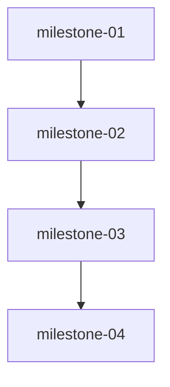

# Plan — Distributed Coding

Created: 2026-08-29T04:01:30.268Z

## Milestones
### milestone-01: M1 Supabase Client & Env Plumbing
Create src/core/supabase/client.ts + index.ts that reads env-only via import.meta.env.VITE_SUPABASE_DB_URL || process.env.DATABASE_URL || process.env.SUPABASE_DB_URL, never hard-codes password/host password, handles missing URL gracefully (local-only fallback), exports isSupabaseEnabled(), getSupabaseConfig(), typed helpers for 11 stores with patientId===CANONICAL_PATIENT_ID scoping. Add src/core/supabase/schema.sql mirroring LocalVault stores (facts, meds, labs, conditions, allergies, proposals, calendar_events, care_circle, doctor_grants, due_cards, danger_reports, documents, question_bank) with patientId index. Ensure .env.example redacted placeholder present and docs, .env gitignored. Verify no baqduk outside .env. No regression to cohesion.
- Workstreams: ws-01-01

### milestone-02: M2 LocalVault Sync & Hydration
Wrap LocalVault add* methods (addMedication, addLab, addFact, addDangerReport, addCalendarEvent, addProposal, addDueCard, addCondition, addAllergy, addDoctorGrant, addCaregiverLink, addQuestion) to optionally syncToSupabase after local emit (non-blocking catch -> local-only + toast, no event duplication). Implement hydrateFromSupabase(patientId) in src/core/vault/supabaseSync.ts that pulls Postgres rows -> Map.set without emitting duplicate added inflation (use has check -> updated vs added, patient isolation exact ===). Handle Supabase down -> fallback. Preserve EventBus relevance matrix.
- Workstreams: ws-02-01
- Depends on: milestone-01

### milestone-03: M3 Bootstrap Integration & Fallback
Update src/main.tsx / src/core/vault/seed.ts bootstrap to: if (isSupabaseEnabled()) { try hydrateFromSupabase(CANONICAL); if (hydrated>0) skip seed; else seedIfEmpty } else seedIfEmpty idempotent. Ensure seedIfEmpty remains single source (no per-view seeds regress). Preserve App.tsx hidden wrappers, ensure wireLocalVaultToEventBus remains. Handle bootstrap async hydration before React mount, with fallback to local seed on error/offline.
- Workstreams: ws-03-01
- Depends on: milestone-02

### milestone-04: M4 Tests/Build/Adversarial & Final Hardening
Add env-gated supabase.test.ts verifying sync+hydration+offline fallback+rapid no-dup+isolation (skips if !DATABASE_URL). Keep cohesion.test.ts 28 green, ensure npm test 133+ PASS, test-runner 231 PASS, lint 0, build 1660+ 40 tools, dist built. Challenger adversarial for missing URL, Supabase error, rapid sync, multi-patient isolation. Verify grep baqduk 0 outside .env, grep p_devi_78 0, seedBaseline 0, EventBus matrix intact.
- Workstreams: ws-04-01, ws-04-02
- Depends on: milestone-03

## Workstreams & Ownership
- **ws-01-01** (milestone-01) — Supabase Client & Schema Layer — files: src/core/supabase/client.ts, src/core/supabase/schema.sql, src/core/supabase/index.ts — owner: worker-supabase-client
- **ws-02-01** (milestone-02) — LocalVault Sync Wrappers & Hydration — files: src/core/vault/LocalVault.ts, src/core/vault/supabaseSync.ts — owner: worker-vault-sync
- **ws-03-01** (milestone-03) — Bootstrap Hydration & Fallback Integration — files: src/main.tsx, src/core/vault/seed.ts — owner: worker-bootstrap
- **ws-04-01** (milestone-04) — Cohesion & Supabase Integration Tests — files: test/tier3-integration/supabase.test.ts, test/tier3-integration/cohesion.test.ts — owner: worker-cohesion-tests
- **ws-04-02** (milestone-04) — Build Lint Tool Integrity Verification — files: src/tools/index.ts, src/core/webmcp/WebMCPEngine.ts, vite.config.ts, test/test-runner.ts — owner: worker-build-verify

## Dependency Graph

