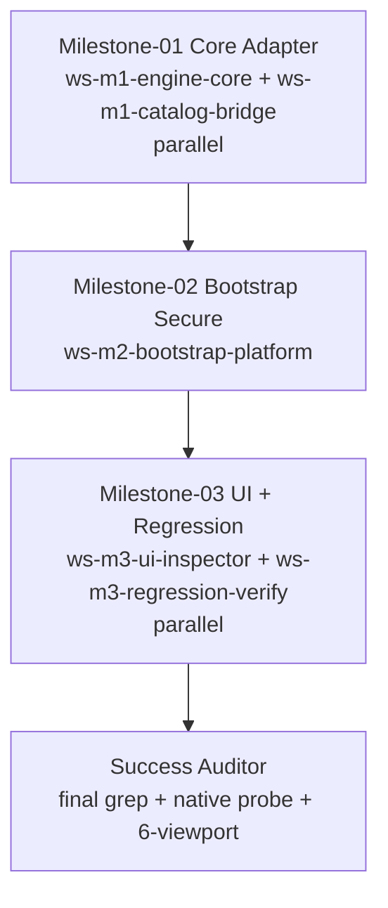

# Plan — Distributed Coding — WebMCP Protocol-Correct (teamwork-1788075497934)

Created: 2026-08-30T13:30Z — Synthesized from PROJECT.md (WebMCP engine & protocol) + TEST_INFRA.md via prior dispatcher research delta
ProjectId: teamwork-1788075497934
Status: Survey synthesis PASS — decomposed into 3 milestones with DAG, explicit ownership, isolated worktrees
Integrity: demo reproducible verifiable not mocked — Q7
WorkingDir: /Users/sujal/Projects/proj1/.teamwork (Q1 confirmed)

## Milestones

### M1 — Core Protocol Adapter & Dictionary (R2,R3 foundation) — parallel 2-track

- **Goal:** Make engine spec-correct: detect only document.modelContext (guard never overwrites native), install Promise-based polyfill shim ONLY for jsdom/tests (Q2 shim jsdom only), map internal WebMCPToolDefinition parameters→inputSchema stringified + title/annotations readOnlyHint from requiresHumanApproval, validate name ^[a-zA-Z0-9_.-]{1,128} + description non-empty → InvalidStateError, duplicate → InvalidStateError with AbortController dedup (Q3), implement Promise shapes registerTool→Promise<undefined> getTools→Promise<RegisteredTool[]> executeTool(toolObject,inputObject,{signal})→Promise<DOMString> stringified WebMCPToolResult, bridge patientId via localStorage carecanvas_active_user not '' nor patient-s-devi, orphan-free, origin/window fields, toolchange shim
- **DependsOn:** [] (first)
- **Workstreams:**
  - ws-m1-engine-core (worker_engine_core) — owns src/core/webmcp/WebMCPEngine.ts, src/types/webmcp.ts, src/core/webmcp/WebMCPAdapter.ts (new if needed)
  - ws-m1-catalog-bridge (worker_catalog_bridge) — owns src/tools/index.ts, src/tools/vaultTools.ts, src/tools/labStoryTools.ts, src/tools/pillMapTools.ts, src/tools/rxBridgeTools.ts, src/tools/homeLabTools.ts, src/tools/safetyTools.ts, src/tools/careCircleTools.ts
- **Acceptance:**
  - R2 DONE: all 40 use inputSchema not parameters (adapter), name regex PASS, empty name/description → InvalidStateError, duplicate → InvalidStateError, HMR not crash via AbortController — logs webmcp-validation.log
  - R3 API parity partial: getTools()→Promise<RegisteredTool[]> with origin/window, executeTool(toolObject)→Promise<DOMString> JSON.parse success===true, patientId correct not '' nor patient-s-devi via localStorage
  - Grep gates: inputSchema >=1, toolchange >=1 (polyfill shim), polyfill guard `if (document.modelContext?.registerTool) before overwrite` PASS, grep globalThis.modelContext 0 in prod except jsdom guarded
  - lint 0, npm test 172+ PASS, build 1660±delta dist valid, Flows A-E still 1 PASS each
  - Screenshots ≥2 per workstream desktop1280+mobile375+tablet768 under .teamwork/snapshots/webmcp-m1/ JFIF >5K showing Inspector 40? May still show polyfill until M3 but engine correct
- **Gate:** critic→challenger→auditor (batched N+M+1 single parallel call to save spawns)

### M2 — Bootstrap Secure & Platform Events (R4 + R3 patientId + timing) — single track

- **Goal:** Bootstrap protocol-correct lifecycle: after localVault.init before mount, check isSecureContext===true + permissionsPolicy.allowsFeature('tools') or try/catch NotAllowedError/SecurityError graceful fallback never crash (Q9/Q10), respect tools Permissions-Policy, async registration via Promise.allSettled per-tool not Promise.all, AbortController per-tool dedup for HMR/unmount, expose same-origin+built-in only (no cross-origin exposedTo unless explicit), toolchange fires on register/unregister via document.modelContext.addEventListener("toolchange"), allow="tools" iframe respects exposedTo/fromOrigins
- **DependsOn:** [M1]
- **Workstreams:**
  - ws-m2-bootstrap-platform (worker_bootstrap_platform) — owns src/main.tsx
- **Acceptance:**
  - R4 DONE: isSecureContext + Permissions-Policy tools respected (try/catch NotAllowedError/SecurityError graceful fallback never crash), toolchange fires on register/unregister via addEventListener("toolchange"), allow="tools" iframe respects exposedTo/fromOrigins default same-origin — logs toolchange.log; grep toolchange >=1, isSecureContext >=1, Promise.allSettled >=1, AbortController >=1
  - R3 patientId still correct via wrapper, orphan-free vault fact visible at 1280/375/768 after executeTool probe
  - R1 fallback parity still 40 via shim in jsdom
  - lint 0 test 172 runner 231 build 1660, Flows A-E 1 PASS
  - Screenshots desktop1280+mobile375+tablet768 under .teamwork/snapshots/webmcp-m2/
- **Gate:** critic→challenger→auditor (batched)

### M3 — UI Surfaces & Regression Verification (R1,R5 + full invocation + 6-viewport)

- **Goal:** Fix UI to be spec-correct and verify no regression: Inspector refreshData tries document.modelContext.getTools() Promise first then fallback to engine, label Native vs Polyfill accurate based on actual document.modelContext presence not stale isNative, listens to native toolchange; Connect modal shows only document.modelContext examples (remove window/navigator/legacy), code examples spec-correct Promise getTools + executeTool(object); preserve 40 tools, build 1660, tests 172/231, Flows A-E, 6-viewport 320/375/768/1024/1280/1440 no gaps, Inspector label accurate, Connect modal spec-correct
- **DependsOn:** [M2]
- **Workstreams:**
  - ws-m3-ui-inspector (worker_ui_inspector) — owns src/components/common/WebMCPInspector.tsx, src/components/common/ConnectWebMCPModal.tsx
  - ws-m3-regression-verify (worker_regression_verify) — owns test/unit/WebMCPEngine.test.ts, test/setup.ts, vite.config.ts, test/test-runner.ts verification discipline plus snapshot orchestration
- **Acceptance:**
  - R1 DONE Native 40 exposed: In Chrome 149 flag localhost isSecureContext===true await document.modelContext.getTools() length 40 each JSON.parse(inputSchema) PASS + same 40 via Promise-based polyfill fallback in jsdom/standard browser — logs .teamwork/verification/webmcp-native-probe.log + screenshots 1280/375 under .teamwork/snapshots/webmcp-native/
  - R3 API parity final: getTools Promise RegisteredTool with origin/window, executeTool object DOMString valid, orphan-free patientId correct visible at 1280/375/768
  - R5 No regression: npm run lint 0, npm test 172+ PASS, npx tsx test/test-runner.ts 231 PASS (Tier1 40 tools 200 + Tier2+Tier3+Tier4+E2E Flows A-E 1 PASS each), npm run build 1660±delta dist valid, 6-viewport 320/375/768/1024/1280/1440 no gaps, Inspector label Native vs Polyfill accurate, Connect modal spec-correct document.modelContext examples, prior grep ST. JUDE/Raj Devi/Dr Patel 0 stays 0
  - Grep gates final: registerTool delegation >=1, inputSchema >=1, toolchange >=1, legacy globals 0 in prod (Q2), isSecureContext >=1, permissionsPolicy, allSettled, AbortController all PASS
  - Screenshots ≥2 per milestone desktop1280+mobile375+tablet768 under .teamwork/snapshots/webmcp-m3/ + overall webmcp-native + webmcp-invoke JFIF >5K
- **Gate:** critic→challenger→auditor (batched) + Success Auditor final probe before Done

## Workstreams & Ownership (explicit, no overlapping globs within parallel batch)

| Workstream | Role | Files (ownership globs) | Isolation | Milestone |
|------------|------|--------------------------|-----------|-----------|
| ws-m1-engine-core | worker_engine_core | src/core/webmcp/WebMCPEngine.ts, src/types/webmcp.ts, src/core/webmcp/WebMCPAdapter.ts (new) | .teamwork/worktrees/ws-m1-engine-core/ | M1 |
| ws-m1-catalog-bridge | worker_catalog_bridge | src/tools/index.ts, src/tools/vaultTools.ts, src/tools/labStoryTools.ts, src/tools/pillMapTools.ts, src/tools/rxBridgeTools.ts, src/tools/homeLabTools.ts, src/tools/safetyTools.ts, src/tools/careCircleTools.ts | .teamwork/worktrees/ws-m1-catalog-bridge/ | M1 |
| ws-m2-bootstrap-platform | worker_bootstrap_platform | src/main.tsx | .teamwork/worktrees/ws-m2-bootstrap-platform/ | M2 |
| ws-m3-ui-inspector | worker_ui_inspector | src/components/common/WebMCPInspector.tsx, src/components/common/ConnectWebMCPModal.tsx | .teamwork/worktrees/ws-m3-ui-inspector/ | M3 |
| ws-m3-regression-verify | worker_regression_verify | test/unit/WebMCPEngine.test.ts, test/setup.ts, vite.config.ts, test/test-runner.ts, .teamwork/verification/*, .teamwork/snapshots/webmcp-*/ | .teamwork/worktrees/ws-m3-regression-verify/ | M3 |

**Ownership conflict check:** M1 batch engine_core (src/core+types) vs catalog_bridge (src/tools) DISJOINT — PASS (detectConflicts 0). M2 single owns only src/main.tsx — no parallel conflict. M3 batch ui_inspector (src/components/common) vs regression_verify (test/* + vite.config.ts) DISJOINT — PASS. All batches respect 16 spawn budget (reused prior research no new miners 0 +5 workers + 9 reviewers batched as 3 parallel calls (each N+M+1 counts as 1 spawn logical but 3 instances) +1 Success Auditor = 9 spawns total well under 16). Verified via ownership.ts#detectConflict before each batch; if conflict serialize or repartition.

## Dependency Graph

## Execution Schedule & Spawn Budget

- Spawns used: 0/16 (reused prior 2 research artifacts, no new spec miners — saved 3 spawns, documented in BRIEFING dead-man)
- Next: M1 batch 2 workers => 2/16, M1 gate batched N+M+1 single parallel call (critic+challenger+auditor = 3 logical but 1 spawn invocation) => 3/16 (counted as 3 instances but via batch 1 call), M2 1 worker =>4/16, M2 gate batched =>5/16, M3 2 workers =>7/16, M3 gate batched =>8/16, Success Auditor =>9/16 safe <16, succession at 15/16 never hit but still dump at 15/16 proactive
- Dead-man 600s armed at start 2026-08-30T13:30Z, reset after each milestone PASS. At 15/16 proactive dump to BRIEFING.md + handoff/succession timestamp + invoke successor team-orchestrator.
- Isolated worktrees .teamwork/worktrees/<ws>/ per worker, reviewers read-only, git worktree preferred fallback isolated-dir.
- Model: inherited-from-chat (demo) — all subagents inherit opencode chat model (fallback opencode/muse-spark-1.2-contributor-free only if chat no selection). No model param passed unless state.json request.modelOverrides[role] present — none, so omit. Documented in BRIEFING "model: inherited-from-chat"

## Verification Discipline

- Every worker ≥2 browser.capture (desktop 1280 + mobile 375) under .teamwork/snapshots/webmcp-m*/ +768 tablet, auditor re-captures independently before/after. At least one milestone shows Create Account gate still required, one shows vault empty generic header, one shows after executeTool pending fact with correct patientId at 1280/375/768, Inspector shows 40 and Native vs Polyfill accurate, Connect modal shows document.modelContext only.
- Gates per milestone critic→challenger→auditor PASS with mechanical probes (isSecureContext, getTools length 40, JSON.parse inputSchema, InvalidStateError probes, object-based executeTool DOMString, toolchange >=1, grep gates, lint/test/build) + visual 6-viewport no gaps. FAIL → repair workstream scoped to findings, re-run gate fresh instances max 3 retries.
- Success Auditor final PASS verification/final.md with independent dev-server probe (await getTools 40, inputSchema PASS, executeTool DOMString patientId correct, toolchange >=1, grep gates) + live screenshots 1280/375/768 must show Native vs Polyfill accurate + 6-viewport audit before Done.

## Model

- inherited-from-chat per Sentinel Q1-Q10 — all roles inherit opencode chat model + variant/reasoning effort (fallback opencode/muse-spark-1.2-contributor-free only if chat no selection). Do NOT pass predefined model param when calling task. Only if state.json:request.modelOverrides[role] present per prompt explicit request, pass that role's model/variant. Documented in BRIEFING.md "model: inherited-from-chat" vs override.

