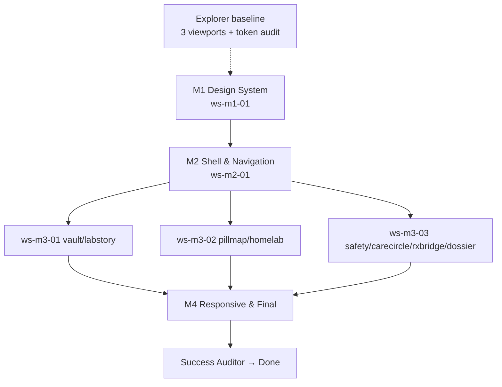

# Plan — Distributed Coding (Modern Professional Intuitive UI)

Created: 2026-08-29T13:16:00Z
Updated: 2026-08-29T13:30:00Z
ProjectId: teamwork-1787989591222
Status: M4 PASS — awaiting Success Auditor (M1-M3 PASS, M4 PASS 2026-08-29T16:35Z)

> Prior Supabase project (teamwork-1787976000076, 4 milestones PASS) archived to /tmp/archive-old-project-1787976000076/. New UI modernization project initialized.

## Milestones (DAG: M1 → M2 → M3 → M4)

### M1 Design System (no deps) — ws-m1-01
- **Goal:** Centralized semantic tokens, typography scale, spacing 4/8, rounded xl/2xl, shadows, refined index.css, App header token use, no scattered hex
- **Files:** tailwind.config.js, src/index.css, (App header token pass)
- **Verification:** >=2 screenshots desktop+mobile under .teamwork/snapshots/m1/, critic→challenger→auditor

### M2 Shell & Navigation (depends M1) — ws-m2-01
- **Goal:** Modern header (glass/shadow, logo, subtitle, chip), pill tabs, mobile bottom nav safe-area, profile switcher, badges, transitions, 8 routes intact
- **Files:** src/App.tsx
- **Verification:** screenshots desktop 1280 + mobile 375 (+ tablet 768) under .teamwork/snapshots/m2/

### M3 Module Polish (depends M2) — ws-m3-01, ws-m3-02, ws-m3-03 parallel
- **Goal:** Vault / LabStory / PillMap / HomeLab / Safety / CareCircle polished (cards, padding, empty/loading, typography), RxBridge/Dossier token-aligned
- **Files partitioned:**
  - ws-m3-01: src/components/vault/*, src/components/labstory/*
  - ws-m3-02: src/components/pillmap/*, src/components/homelab/*
  - ws-m3-03: src/components/safety/*, src/components/carecircle/*, src/components/rxbridge/*, src/components/dossier/*
- **Verification:** per-workstream screenshots aggregated .teamwork/snapshots/m3/

### M4 Responsive & Final Hardening (depends M3) — ws-m4-01, ws-m4-02 parallel
- **Goal:** index.css responsive, max-w-7xl, overflow fixes, modals cohesive, common components token-aligned, performance & a11y
- **Files partitioned:**
  - ws-m4-01: src/index.css, src/App.tsx (container/overflow polish)
  - ws-m4-02: src/components/common/* (PrivacyBadge, QuestionBank, WebMCPInspector, ToastContainer, BoundingBoxViewer)
- **Verification:** screenshots at 320/375/768/1024/1280/1440, final gates + Success Auditor independent dev-server audit

## Workstreams & Ownership (explicit, non-overlapping per milestone)

| Workstream | Milestone | Files (globs) | Owner | Status | Isolation |
|------------|-----------|---------------|-------|--------|-----------|
| ws-m1-01 | M1 | tailwind.config.js, src/index.css, src/App.tsx (header token only) | worker-m1-01 | pending | .teamwork/worktrees/ws-m1-01/ |
| ws-m2-01 | M2 | src/App.tsx | worker-m2-01 | pending | .teamwork/worktrees/ws-m2-01/ |
| ws-m3-01 | M3 | src/components/vault/*, src/components/labstory/* | worker-m3-01 | pending | .teamwork/worktrees/ws-m3-01/ |
| ws-m3-02 | M3 | src/components/pillmap/*, src/components/homelab/* | worker-m3-02 | pending | .teamwork/worktrees/ws-m3-02/ |
| ws-m3-03 | M3 | src/components/safety/*, src/components/carecircle/*, src/components/rxbridge/*, src/components/dossier/* | worker-m3-03 | pending | .teamwork/worktrees/ws-m3-03/ |
| ws-m4-01 | M4 | src/index.css, src/App.tsx | worker-m4-01 | completed | .teamwork/worktrees/ws-m4-01/ |
| ws-m4-02 | M4 | src/components/common/* | worker-m4-02 | completed | .teamwork/worktrees/ws-m4-02/ |

**Conflict check:** Within each milestone, globs are disjoint. M4 ws-m4-01 re-owns index.css/App.tsx after M1/M2/M3 completed — serialized by DAG, no concurrent overlap. Verified via ownership.ts logic equivalent (no overlapping globs in same batch).

## Dependency Graph

## Explorer
- Baseline: research/explorer-*.md with screenshots at 375/768/1280, tailwind token audit, a11y audit, proposes design system approach
- Runs before M1 workers, read-only

## Gates
- Per milestone: critic → challenger → auditor (all PASS, screenshot evidence required)
- Final: Success Auditor (lint, test, build, grep, live screenshot audit at 3 viewports)

## Snapshots
- .teamwork/snapshots/m1/, m2/, m3/, m4/ — each milestone >=2 captures (desktop 1280 + mobile 375), tablet 768 optional, auditor re-captures

## Risks & Mitigations
- Hex sprawl (#EEF2FF) → centralized tokens, grep check in auditor
- Responsive breakage → M4 dedicated, challenger tests edge viewports/long text/empty
- Regression (p_devi_78, supabase, 40 tools) → grep + build checks per auditor

