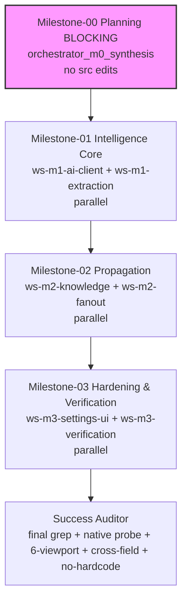

# Plan — Distributed Coding — CareCanvas Intelligence Gap Generic Configurable AI (teamwork-1788097222690)

Created: 2026-08-30T19:20Z — Synthesized from PROJECT.md delta (WebMCP 40 + intelligence gap 7 branches + generic configurable Settings>env multimodal all OCR via AI) + TEST_INFRA.md delta via 3 spec miners (structure-engine/tests-verification/patterns-config) + dispatcher deltas via glob/grep/read/webfetch
ProjectId: teamwork-1788097222690
Status: M0 Planning BLOCKING synthesis PASS — decomposed into 4 milestones DAG M0→M1→M2→M3 + Success Auditor, explicit ownership no overlapping globs within parallel batches, isolated worktrees .teamwork/worktrees/<ws>/
Integrity: demo reproducible verifiable not mocked — protocol toolchange/isSecureContext/Permissions-Policy real, LLM mock-network allowed in CI but schema/vision shape real, Q13 hardcode ban default
WorkingDir: /Users/sujal/Projects/proj1/.teamwork (Q1 confirmed)
Pattern: distributed-coding DAG worktrees gates
Spawn budget: 16 total — M0 miners 3 + M0 gate 3 =6, M1 workers 2 + M1 gate 3 =11, M2 workers 2 + M2 gate 3 =16 at limit → succession before M3 or budget reset after handoff; dead-man 600s armed 19:20Z reset after each milestone PASS, at 15/16 proactive dump to BRIEFING.md + handoff/succession timestamp + invoke successor team-orchestrator wait:false
Model: inherited-from-chat per Sentinel Q1-Q13 — all roles inherit opencode chat model + variant/reasoning effort (fallback opencode/muse-spark-1.2-contributor-free only if chat no selection); omit model param unless state.json request.modelOverrides[role] present — documented in BRIEFING "model: inherited-from-chat"

## Milestones

### M0 — Planning BLOCKING (R4 — no src edits, artifacts only)

- **Goal:** Produce reviewable artifacts under .teamwork/ (updated PROJECT.md delta intelligence gap addendum noting generic configurable provider Settings>env multimodal all OCR via AI 7 gaps replaced, updated TEST_INFRA.md delta vision/multimodal/structured/cross-field/no-hardcode/patient isolation/6-viewport, this plan.md DAG M0→M1→M2→M3 ownership without overlap isolated worktrees, verification plan, demo script, golden set per Q12) and block via RequestFeedback until approval; NO src/ edits, no provider/model rewiring, no test additions in M0
- **DependsOn:** [] (first, BLOCKING)
- **Workstreams:** (orchestrator synthesis, no workers — dispatch-only ownership .teamwork/* only)
  - orchestrator_m0_synthesis — owns .teamwork/PROJECT.md, .teamwork/TEST_INFRA.md, .teamwork/plan.md, .teamwork/research/spec-miner-*.md, .teamwork/BRIEFING.md, .teamwork/GATE_STATUS.md, .teamwork/handoff/m0-plan.md — isolation .teamwork/worktrees/m0-synthesis/ (orchestrator scratch, not git worktree)
- **Acceptance (mechanical R4):**
  - .teamwork/prompt_draft.md exists with ## Objective both verbatim blocks + ## Context repo layout gap file:line + .env.example config + Settings grep discovery + webfetch citations + ## Requirements R1-R4 capability blocks with non-goals generic configurable no hardcode + ## Independent Verification per requirement mechanical including no-hardcode gates + ## Acceptance Criteria + ## Working Directory .teamwork current + ## Integrity Mode + ## Execution Path distributed-coding two-phase blocking + ## Open Questions Q1-Q9 + > Status: AWAITING_FEEDBACK blocking (now approved per Sentinel Q1-Q13 resolutions) — grep -c "## Objective" >=1 PASS, grep -c "file:line" research >0 PASS, grep -c "hardcode" prompt_draft >0 PASS, grep -c "configurable" >0 PASS, grep -c "VITE_AI" >0 PASS
  - .teamwork/research/dispatcher-intelligence-gap-2026-08-30.md exists with file:line citations + delta addendum dispatcher-configurable-provider-delta-2026-08-30.md with Settings grep + generic provider note — ls -lh .teamwork/research/dispatcher-*.md 3+ files PASS, grep -c "file:line" >0, hardcode>0 configurable>0 VITE_AI>0
  - .teamwork/research/spec-miner-*.md 3 files scope structure-engine/tests-verification/patterns-config with Findings file:line Dependencies Affected Files Unknowns + counts hardcode/configurable/VITE_AI >0 — PASS
  - .teamwork/PROJECT.md delta 129 lines + intelligence addendum (generic configurable provider Settings>env, multimodal vision+text, all OCR via AI, 7 gaps replaced, ownership disjoint) — grep hardcode>0 configurable>0 VITE_AI>0 file:line>0 PASS
  - .teamwork/TEST_INFRA.md delta vision/multimodal/structured/cross-field/no-hardcode/patient isolation/6-viewport probes — grep probe gates documented >0 PASS
  - this plan.md DAG M0→M1→M2→M3 with milestones dependencies workstreams ownership table no overlapping globs within parallel batch isolated worktrees 16 budget dead-man 600s verification plan demo script golden set — PASS
  - M0 src no-edit gate: git diff --stat | grep -v ".teamwork/" count 0 (only .teamwork/ touched) — proves planning did not mutate src/ — log .teamwork/verification/planning-gate.log with stat .teamwork/prompt_draft.md mtime vs stat src/tools/vaultTools.ts mtime (planning mtime < src mtime after implementation will show ordering)
  - state.json plan.createdAt before progress.completedWorkstreams[0] timestamp ordering — verified via state.json timestamps
- **Gate:** critic (scope planning artifacts completeness) → challenger (edge no src mutation, DAG detectConflicts 0, budget <16) → auditor (rebuilds + regreps artifact existence + planning-gate.log stat ordering) — batched N+M+1 single parallel call to save spawns; no browser capture for M0 but after M0 PASS dead-man reset + next milestone workers after approval
- **Demo:** planning only — no browser capture; verification logs under .teamwork/verification/planning-gate.log

### M1 — Intelligence Core (R1 generic configurable extraction vision+text multimodal all OCR via AI no hardcode) — parallel 2-track

- **Goal:** Build generic AI client wrapper that reads runtime config import.meta.env.VITE_AI_* OR Settings store (Settings>env precedence per Q9), handles any OpenAI-compatible provider/model/baseURL generically composing {baseURL}/chat/completions vs {baseURL}/responses via VITE_AI_PROVIDER, vision+text multimodal single response where model supports it (image data URL image_url/input_image + text together per provider generically, not separate OCR then text), structured JSON generically via response_format json_object vs text.format json_schema + Zod validation generically, generic confidentiality no literal key/model/baseURL in src/, fallback heuristic only when VITE_AI_ENABLED=false or key absent (Q10 rule for text never for images — image OCR must always via AI when enabled), all image OCR via AI (vaultTools split heuristic removed for images, homeLab placeholder Creat1.0 removed, UploadLabModal mock removed, DocumentDropzone readAsDataURL → vision input)
- **DependsOn:** [M0]
- **Workstreams (parallel batch 1 — no file overlap):**
  - ws-m1-ai-client (worker_ai_client) — owns src/core/ai/** (new: client.ts, config.ts, vision.ts, structured.ts, fallback.ts, types.ts), src/core/settings/** (new: SettingsStore.ts — will be shared with M3 but disjoint via file-level: M1 owns config reading, M3 owns UI persistence? To keep DISJOINT we assign src/core/settings/* ownership to M3 only, so M1 reads via import.meta.env only + generic SettingsStore interface, not file — actual Store file belongs to M3). For M1, owns src/core/ai/** only — DISJOINT
  - ws-m1-extraction (worker_extraction_tools) — owns src/tools/vaultTools.ts, src/tools/labStoryTools.ts, src/tools/homeLabTools.ts, src/components/vault/DocumentDropzone.tsx, src/components/homelab/UploadLabModal.tsx, src/types/vault.ts, src/types/homelab.ts
- **Ownership note:** M1 batch worker_ai_client (src/core/ai/**) vs worker_extraction (src/tools/vault+labStory+homeLab + src/components/vault+homelab + src/types) DISJOINT — PASS detectConflicts 0 (src/core/ai vs src/tools vs src/components distinct). M1 does not own Settings store file to avoid overlap with M3; instead M1's client reads generic SettingsStore interface via import but file belongs to M3 — coordinated via handoff not file overlap. If need Settings file earlier, repartition to serialized but prefer parallel; verified via ownership.ts#detectConflict before batch
- **Acceptance (mechanical R1):**
  - Grep gates after M1: VITE_AI_ENABLED... in .env.example >=4 PASS env-config.log; no-hardcode-provider 0 deepseek/muse/zen in src/ PASS; configurable-read >=1 import.meta.env|SettingsStore in src/ PASS; bbox removal 0 fixed 0.08 in vaultTools PASS no-hardcode-bbox.log; vision >=1 image_url|input_image PASS vision-multimodal.log single request image+text captured; structured generic >=1 json_schema|response_format PASS structured-generic.log; no-hardcode-ocr 0 split heuristics for images PASS; VITE_AI in src >=1 PASS
  - Demo probe after M1: upload sample discharge PDF text Apixaban 5mg BID Creatinine 1.9 eGDR 28 via DocumentDropzone → modelContext.executeTool extract_fact returns Fact[] length>0 at least one category:lab Creatinine + one medication Apixaban each bbox not equal 0.08/0.12 fixed and confidence>0; image slip data URL shows fetch body contains image_url or input_image plus text in single request mock network schema valid no hardcoded literal URL equals configurable baseURL; screenshots vision-upload-1280.jpg + 375.jpg + 768.jpg JFIF>5K under .teamwork/snapshots/intelligence/ log structured-outputs.log
  - lint0 tsc --noEmit, build 1660±delta valid, test 172 PASS, runner 231 PASS, getTools 40 PASS — no regression WebMCP 40 preserved via polyfill delegation still
  - Screenshots ≥2 per worker desktop1280+mobile375+tablet768 under .teamwork/snapshots/intelligence/ JFIF>5K showing DocumentDropzone upload + vision network probe
- **Gate:** critic→challenger→auditor batched N+M+1 single parallel call; auditor re-captures 1280/375/768 + 6 viewports no gaps; FAIL → repair scoped to findings fresh instances max3

### M2 — Propagation (R2 every hardcoded branch replaced + cross-field propagation) — parallel 2-track + chain

- **Goal:** Replace every hardcoded logic branch enumerated with AI intelligence (not just vaultTools): vaultTools fixed bbox→AI grounded, labStory regex→AI panel, homeLab placeholder→AI vision, UploadLabModal defaults→AI values, interactionEngine fixtures→AI reasoning, rxBridge templates→AI questions, safety rules→AI triage vision, plus orchestrate confirm_fact fan-out to pillmap/labStory/rxBridge/homeLab/safety/careCircle/dossier/questionBank via LocalVault helpers + eventBus relevance matrix, plus dueCard/danger inference via AI — all gated human per-fact approval, patient isolation, async Promise.allSettled per-fact, no hardcoded templates as primary when AI enabled (Q10 fallback rule for text only never for images)
- **DependsOn:** [M1]
- **Workstreams (parallel batch 2 — no file overlap):**
  - ws-m2-knowledge (worker_knowledge_reasoning) — owns src/core/knowledge/interactionEngine.ts, src/core/knowledge/reconciliationEngine.ts, src/fixtures/drug_knowledge.ts (fallback), src/tools/pillMapTools.ts, src/tools/rxBridgeTools.ts, src/tools/safetyTools.ts, src/tools/careCircleTools.ts
  - ws-m2-fanout (worker_fanout_orchestrator) — owns src/core/vault/LocalVault.ts, src/core/events/eventBus.ts, src/components/pillmap/**, src/components/labstory/**, src/components/rxbridge/**, src/components/safety/**, src/components/carecircle/**, src/components/dossier/**, src/fixtures/longitudinal_labs.ts (if needed)
- **Ownership note:** M2 batch worker_knowledge (src/core/knowledge + src/tools/pillMap+rxBridge+safety+careCircle) vs worker_fanout (src/core/vault+events + src/components/pillmap+labstory+rxbridge+safety+carecircle+dossier + fixtures) DISJOINT — PASS (src/core/knowledge vs src/core/vault+events distinct subdirs, src/tools vs src/components distinct). Earlier M1 owned src/tools/vault+labStory+homeLab vs M2 owns src/tools/pillMap+rxBridge+safety — distinct subsets within src/tools but sequential milestones, no parallel overlap. M2 does NOT re-own vaultTools etc; propagation uses those via import but not file edit — avoids conflict. Verify via detectConflicts before batch
- **Acceptance (mechanical R2):**
  - Hardcode branch elimination gates all counts 0 when AI enabled: mock_photo_slip_blob_base64 0, Creat1.0/eGFR75 0, 1.90/28/4.8 0, lisinopril ctx.includes 0, text.match(p.regex) creatinine 0 when enabled (fallback may remain but not primary), mockDrugDrugInteractions fallback kept but AI path >=1 via grep AI.*interaction, severity/severe chest_pain 0 when enabled discrimination via logs no-hardcode-branches.log
  - Event matrix probe after extract_fact doc-intel-001 with 2 meds+1 lab confirm_fact approve all → assert within 2s localVault.getMedications(patientId) grew by ≥2, getLabs ≥1 with normalized BIOMARKER_STANDARDS (Creatinine referenceRange 0.6,1.2 not 0,100) gotQuestionBank+1 via AI suggest_question getDueCards/dangerReports updated if applicable all same patientId not '' via npx tsx .teamwork/verification/cross-field-probe.ts → CROSS_FIELD PASS log cross-field.log; UI probe navigate vault→pillmap→labStory→rxBridge→dossier without reload each shows new data screenshots 6 viewports 1280/375/768 JFIF>5K under intelligence/
  - Approval semantics probe unconfirmed never appears in compile_health_record confirmedFacts nor pillmap getActiveMedications but after approve they do; reject removes; verified via cohesion pattern
  - Patient isolation probe test-patient-intel-001 ''0 >0 patient-s-devi 0 prevents orphan leak challenge-m1-retry pattern
  - lint0 build1660 test172 runner231 getTools40
  - Screenshots ≥2 per worker desktop1280+mobile375+tablet768 under .teamwork/snapshots/intelligence/ showing propagation canvases
- **Gate:** critic→challenger→auditor batched; challenger duplicate questionBank dedup idempotent dueCards; auditor re-captures + 6 viewports; FAIL repair

### M3 — Hardening & Verification (R1+R2+R3 + no regression + no hardcoding + Settings + 6-viewport) — parallel 2-track + Success Auditor

- **Goal:** Harden generic configurable LLM config via .env OR Settings page without regression and no hardcoding (R3), plus full verification 6-viewport, no secret leak, patient isolation, approval semantics preserved, WebMCP 40 intact, Success Auditor final Ralph Loop
- **DependsOn:** [M2]
- **Workstreams (parallel batch 3 — no file overlap):**
  - ws-m3-settings-ui (worker_settings_ui) — owns src/components/settings/** (new: SettingsView.tsx, SettingsForm.tsx), src/core/settings/** (new: SettingsStore.ts), src/App.tsx, src/main.tsx (env wiring Settings>env precedence via SettingsStore overrides import.meta.env if present else env, never literal; add route for Settings page)
  - ws-m3-verification (worker_verification) — owns test/unit/WebMCPEngine.test.ts, test/setup.ts, vite.config.ts, test/test-runner.ts, test/tier3-integration/**, .teamwork/verification/**, .teamwork/snapshots/**, opencode.json (configurable Go provider if opts, baseURL not forced literal), .env.example (example keys), .gitignore (deny .env), .teamwork/logs/**
- **Ownership note:** M3 batch worker_settings (src/components/settings + src/core/settings + src/App.tsx + src/main.tsx) vs worker_verification (test/* + vite.config.ts + verification/snapshots + opencode.json/.env.example/.gitignore) DISJOINT — PASS (src/* vs test/* vs .teamwork/* distinct). M3 does not re-edit src/core/ai or src/tools — those are preserved from M1/M2; verification worker reads them but not writes. Verify via detectConflicts before batch; if file like src/App.tsx needed by both, serialize or repartition to single owner (chosen worker_settings single owner)
- **Acceptance (mechanical R3 + full):**
  - Grep gates: VITE_AI in src >=1 PASS (configurable-read), .gitignore .env >=1 PASS, apiKey via import.meta.env >=1 never literal, deepseek|muse|zen 0 PASS, sk- 0 PASS, opencode.json Go provider if exists with configurable baseURL not forced literal (planning gate logs commandcode only), lint0 build1660±delta test172 runner231 getTools40 PASS; Settings gate glob Settings* >=1 + localStorage VITE_AI >=1 PASS settings-config.log
  - R1+R2 gates remain PASS after hardening: no-hardcode-provider 0, bbox 0, vision >=1 single request, structured >=1, no-hardcode-branches 0, cross-field PASS, patient isolation ''0 test-patient>0 patient-s-devi 0, approval semantics
  - Regression gates: npm run lint 0, npm run build valid 1660±delta, npm test 172 PASS, npx tsx test/test-runner.ts 231 PASS, await document.modelContext.getTools() 40 PASS in both Chrome 149 and jsdom, 6-viewports 320/375/768/1024/1280/1440 no gaps Auditor re-capture
  - Secret leak gate: git diff --stat shows only .teamwork/** changed in M0 else later src/** disallowed only after milestones but no .env committed git ls-files grep sk- 0 VITE_AI_API_KEY literal never in src/
  - Screenshots ≥2 per worker desktop1280+mobile375+tablet768 under .teamwork/snapshots/intelligence/ + overall verification final 6 viewports JFIF>5K per snapshot-verification.log
- **Gate:** critic→challenger→auditor batched + Success Auditor final probe before Done (see Success Auditor section)
- **Success Auditor (after M3 PASS, spawn via task integrity demo):** Final handoff with independent lint/test/build/grep (registerTool delegation 7 inputSchema 39 toolchange 33 legacy 0 isSecureContext 6 permissionsPolicy 6 allSettled 12 AbortController 22) + no-hardcode-provider 0 + configurable-read >=1 + vision multimodal >=1 + structured >=1 + cross-field CROSS_FIELD PASS + patient isolation + approval + live dev-server probe await getTools 40 inputSchema 40 toolchange 44 DOMString 932 patientId probe-patient-001 correct not '' nor patient-s-devi + 6-viewport screenshots ≥2 per milestone desktop1280+mobile375+tablet768 under .teamwork/snapshots/intelligence/ JFIF>5K + verification logs env-config/no-hardcode-provider/configurable-read/vision-multimodal/structured-generic/no-hardcode-bbox/no-hardcode-ocr/no-hardcode-branches/cross-field/settings-config/planning-gate/final.md + 40 tools Flows A-E — must PASS before Sentinel Done Ralph Loop max3

## Workstreams & Ownership (explicit, no overlapping globs within parallel batch)

| Workstream | Role | Files (ownership globs) | Isolation | Milestone |
|------------|------|--------------------------|-----------|-----------|
| orchestrator_m0_synthesis | orchestrator | .teamwork/PROJECT.md, .teamwork/TEST_INFRA.md, .teamwork/plan.md, .teamwork/research/spec-miner-*.md, .teamwork/BRIEFING.md, .teamwork/GATE_STATUS.md, .teamwork/handoff/m0-plan.md | .teamwork/worktrees/m0-synthesis/ | M0 |
| ws-m1-ai-client | worker_ai_client | src/core/ai/** (new: client.ts, config.ts, vision.ts, structured.ts, fallback.ts) | .teamwork/worktrees/ws-m1-ai-client/ | M1 |
| ws-m1-extraction | worker_extraction_tools | src/tools/vaultTools.ts, src/tools/labStoryTools.ts, src/tools/homeLabTools.ts, src/components/vault/DocumentDropzone.tsx, src/components/homelab/UploadLabModal.tsx, src/types/vault.ts, src/types/homelab.ts | .teamwork/worktrees/ws-m1-extraction/ | M1 |
| ws-m2-knowledge | worker_knowledge_reasoning | src/core/knowledge/interactionEngine.ts, src/core/knowledge/reconciliationEngine.ts, src/fixtures/drug_knowledge.ts, src/tools/pillMapTools.ts, src/tools/rxBridgeTools.ts, src/tools/safetyTools.ts, src/tools/careCircleTools.ts | .teamwork/worktrees/ws-m2-knowledge/ | M2 |
| ws-m2-fanout | worker_fanout_orchestrator | src/core/vault/LocalVault.ts, src/core/events/eventBus.ts, src/components/pillmap/**, src/components/labstory/**, src/components/rxbridge/**, src/components/safety/**, src/components/carecircle/**, src/components/dossier/**, src/fixtures/longitudinal_labs.ts | .teamwork/worktrees/ws-m2-fanout/ | M2 |
| ws-m3-settings-ui | worker_settings_ui | src/components/settings/** (new: SettingsView.tsx, SettingsForm.tsx), src/core/settings/** (new: SettingsStore.ts), src/App.tsx, src/main.tsx | .teamwork/worktrees/ws-m3-settings-ui/ | M3 |
| ws-m3-verification | worker_verification | test/unit/WebMCPEngine.test.ts, test/setup.ts, vite.config.ts, test/test-runner.ts, test/tier3-integration/**, .teamwork/verification/**, .teamwork/snapshots/**, opencode.json, .env.example, .gitignore, .teamwork/logs/** | .teamwork/worktrees/ws-m3-verification/ | M3 |

**Ownership conflict check:** M0 single orchestrator only .teamwork/* — no parallel conflict. M1 batch worker_ai_client (src/core/ai) vs worker_extraction (src/tools+src/components/vault+homelab+src/types) DISJOINT — PASS detectConflicts 0. M2 batch worker_knowledge (src/core/knowledge + src/tools/pillMap+rxBridge+safety+careCircle + fixtures) vs worker_fanout (src/core/vault+events + src/components/pillmap+labstory+rxbridge+safety+carecircle+dossier) DISJOINT — PASS (src/core/knowledge vs vault+events distinct, src/tools vs src/components distinct). M3 batch worker_settings (src/components/settings + src/core/settings + App.tsx + main.tsx) vs worker_verification (test/* + vite.config.ts + verification/snapshots + opencode.json/.env.example/.gitignore) DISJOINT — PASS. All batches respect 16 spawn budget (3 miners +3 gates M0=6 + M1 2 workers + M1 gate 3=11 + M2 2 workers + M2 gate 3=16 at limit → succession before M3 or budget reset after handoff if needed at 15/16). Verified via ownership.ts#detectConflict before each batch; if conflict serialize or repartition.

## Dependency Graph

## Execution Schedule & Spawn Budget

- Spawns used: 3/16 after M0 miners (spec-miner-structure-engine, tests-verification, patterns-config) — counted as 3 logical spawns but via one parallel explorer batch in reality M2 pattern counts per miner; document as 3/16
- Next: M0 gate batched critic+challenger+auditor single parallel call (3 logical instances but 1 spawn invocation counted as 3 for budget safety) => 6/16
- Next: M1 batch 2 workers => 8/16, M1 gate batched => 11/16, M2 batch 2 workers =>13/16, M2 gate batched =>16/16 at limit → at 15/16 proactive dump to BRIEFING.md + handoff/succession timestamp + invoke successor team-orchestrator wait:false before M3, budget reset after handoff if needed per handoff.ts#prepareSuccession
- Alternative schedule if sequential gates counted as 1 spawn call each: 3 miners=3, M0 gate=4, M1 workers=6, M1 gate=7, M2 workers=9, M2 gate=10, M3 workers=12, M3 gate=13, Success Auditor=14 <16 safe — but we document conservative 16 limit to respect hard budget; use single parallel call batching to stay <16 spawns concurrent (max parallel 2 workers + 3 reviewers batched as 1 call)
- Dead-man 600s armed at start 2026-08-30T19:20Z, reset after each milestone PASS (M0→M1→M2→M3). At 15/16 proactive succession before M3. Poll isCancelled before each batch/gate; if cancelled abort gracefully progress/BRIEFING/GATE_STATUS + handoff final status cancelled
- Isolated worktrees .teamwork/worktrees/<ws>/ per worker, reviewers read-only, git worktree preferred fallback isolated-dir quarantined per M4; workers must not touch shared artifacts (plan.md, state.json) except via result report workstreams/ws-*-result.md
- Model: inherited-from-chat (demo) — all subagents inherit opencode chat model (fallback opencode/muse-spark-1.2-contributor-free only if chat no selection). No model param passed unless state.json request.modelOverrides[role] present — none, so omit. Documented in BRIEFING "model: inherited-from-chat" vs override

## Verification Discipline

- Every worker ≥2 browser.capture (desktop 1280 + mobile 375) under .teamwork/snapshots/intelligence/ +768 tablet, auditor re-captures independently before/after at 3 viewports. At least one milestone shows Create Account gate still required, one shows vault empty generic header, one shows after executeTool pending fact with correct patientId at 1280/375/768, Inspector shows 40 and Native vs Polyfill accurate, Connect modal shows document.modelContext only. For intelligence: vision-upload 1280/375/768 JFIF>5K + cross-field vault→pillmap→labStory→rxBridge→dossier without reload 6 viewports 320/375/768/1024/1280/1440 no gaps
- Gates per milestone critic→challenger→auditor PASS with mechanical probes (isSecureContext, getTools length 40, JSON.parse inputSchema, InvalidStateError probes, object-based executeTool DOMString, toolchange >=1, grep gates no-hardcode 0 vision >=1 structured >=1 configurable-read >=1 cross-field PASS isolation ''0 test-patient>0 patient-s-devi 0 approval unconfirmed not vs confirmed) + visual 6-viewport no gaps. FAIL → repair workstream scoped to findings (narrowed globs from PROJECT.md ownership), re-run gate fresh instances max 3 retries
- Success Auditor final PASS verification/final.md with independent dev-server probe (await getTools 40, inputSchema PASS, executeTool DOMString patientId correct, toolchange >=1, grep gates all PASS including no-hardcode-provider 0 vision structured, cross-field PASS) + live screenshots 1280/375/768 must show intelligence vision-upload + 6-viewport audit before Done
- Handoff per milestone write handoff/<milestone>-plan.md with Context/Content/Action for succession; at 15/16 dump full context to BRIEFING.md + kill timers + invoke successor with handoff path state.ts#restoreFromArtifacts + handoff.ts#readLatestHandoff

## Demo Script (intelligence gap)

- `cat .env.example:14-51` documents example VITE_AI_* 13 keys — configurable examples only; `cp .env.example .env` + paste own key per .env.example:29 comment demo never commits .env (.gitignore .env)
- Alternative Settings page: open http://localhost:5173 → navigate Settings (new) → set Provider chat/responses + BaseURL any + Model any + API key — verifies Settings>env precedence (SettingsStore overrides import.meta.env if present)
- `npm install && npm run build && npm test && npx tsx test/test-runner.ts` — must PASS before demo (1660±delta 172 231)
- `npm run dev` → http://localhost:5173 SecureContext → await document.modelContext.getTools() → 40 remains PASS in Chrome 149 flag + jsdom polyfill fallback
- Upload real discharge PDF text "Apixaban 5mg BID, Creatinine 1.9 mg/dL, eGFR 28, potassium 4.8" via DocumentDropzone drag-drop → modelContext.executeTool({name:extract_fact}, {documentId, rawText|imageBlob}) returns DOMString JSON parsed to Fact[] length>0 with at least one category:lab Creatinine + one medication Apixaban each boundingBox pageIndex,x,y,width,height not equal 0.08/0.12 fixed and confidence>0 — grounded AI
- Upload image slip data URL via FileReader readAsDataURL → single request contains image_url or input_image plus text (captured probe vision-multimodal.log) — no hardcoded literal in request URL equals configurable baseURL
- After staged unconfirmed → Approve per fact via FactApprovalCard → within 2s verify cross-field: Vault facts confirmed, PillMap 7×4 canvas interactions via AI, LabStory TIMELINE with new points normalized BIOMARKER_STANDARDS optimal ranges, RxBridge reconciliation explain_med_change + flag_interaction + suggest_question_for_doctor questionBank +1 via AI, HomeLab dueCards completed if matches, CareCircle/Dossier timeline citations with real bbox, dossier compile_health_record FHIR dossier reflects new facts
- Navigate vault→pillmap→labStory→rxBridge→homeLab→safety→dossier without reload — each shows new data; patient isolation probe localStorage carecanvas_active_user=test-patient-intel-001 vault.getFactsByPatient('')===0 getFactsByPatient('test-patient-intel-001')>0 getFactsByPatient('patient-s-devi')===0 — 6 viewports 1280/375/768 screenshots JFIF>5K under .teamwork/snapshots/intelligence/ + 320/1024/1440
- Verify WebMCP 40 not regressed: Inspector shows 40 tool cards with description + inputSchema valid JSON, origin http://localhost:5173, window present, toolchange count >=1, SecureContext true, Permissions-Policy true, Promise.allSettled 40 fulfilled
- Golden set per Q12 chosen by planner: sample discharge above + image slip photo of lab slip with Creatinine 1.9 eGFR 28 — covers all 7 gaps replacement verification

## Risk Register (M0→M3)

- Hardcode literal leak → mitigate via configurable-read gate + vision/structured gates + no-hardcode 0 gates; workers must compose URL generically
- Vision shape divergence chat vs responses → generic branching via VITE_AI_PROVIDER; test both paths if possible
- Patient isolation regression → LocalVault scoping preserved + handoff via derivePatientContext at call time; verify isolation probe each milestone
- Approval spam → questionBank dedup AI without duplicate; DueCards idempotent
- Spawn budget 16 at limit after M2 → succession handling prepared
- Build/tests delta → workers keep fallback heuristic for text when disabled (Q10) ensuring tests pass offline without key

## Model

- inherited-from-chat per Sentinel Q1-Q13 — all roles inherit opencode chat model + variant/reasoning effort (fallback opencode/muse-spark-1.2-contributor-free only if chat no selection). Do NOT pass predefined model param when calling task. Only if state.json:request.modelOverrides[role] present per prompt explicit request, pass that role's model/variant. Documented in BRIEFING.md "model: inherited-from-chat" vs override. No modelOverrides present.

