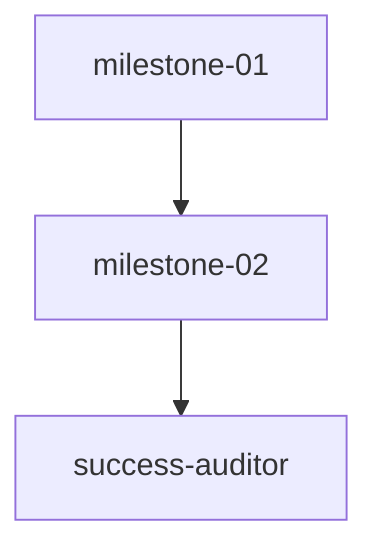

# Plan — HOTFIX Iterative — First PDF upload AI not invoked (teamwork-1788173131990)

Created: 2026-08-31T16:15:00.000Z — HOTFIX synthesis for DocumentDropzone PDF garbled + AI disabled lingering — file:line grounded, ownership per PROJECT.md, not guessed
ProjectId: teamwork-1788173131990
Status: Decomposition complete — single hotfix milestone-02, single worker iterative on main, small diff ≤8 files net +80 lines
Integrity: development rapid — single worker iterative, mock fetch verification, thorough multimodal REAL File inputs required
WorkingDir: /Users/sujal/Projects/proj1/.teamwork
Pattern: distributed-coding but executionPath iterative-coding (hotfix single milestone on main, no distributed sprawl)
Spawn budget: 16 total — prior 8 used (3 miners+1 worker+1 critic+1 challenger+1 auditor+1 success) — hotfix uses 1 worker +3 reviewers +1 success =5 — total 13/16 safe — remaining 3
Dead-man: 600s reset 2026-08-31T16:15:00Z after decomposition — next due 2026-08-31T16:25:00Z

## Milestones (decomposed per PROJECT.md ownership map, topological sort via scheduler.ts)

### milestone-01: M1 Iterative AI Refactor (R1+R2+R3) — PASSED

- Goal: Fix hardcoded AI responses, verify completions/responses multimodal, remove hacks — DONE 2026-08-31T11:20:41Z — lint0 build1672 test174 runner231 WebMCP40 — ownership 15 files single worker no conflict

### milestone-02: HOTFIX — First PDF upload via DocumentDropzone does NOT invoke AI

- Goal: Fix DocumentDropzone PDF readAsText garbled (%PDF binary) so first PDF upload via Add Your Health Papers Drop a PDF or photo to extract details DOES invoke AI when isAIEnabled true, and also heuristic fallback yields ≥1 staged fact when AI disabled (not 0). Preserve WebMCP40, patient isolation, approval, no secret leak, lint0 build1672 test174 runner231 PASS.
- Workstreams: ws-hotfix-pdf-ai — HOTFIX PDF+Image multimodal + config precedence + real File probe
- Acceptance (mechanical):
  - R-hotfix-1: Upload PDF via DocumentDropzone handleFiles (File type application/pdf, name test.pdf with text Apixaban 5mg BID, Creatinine 1.90 mg/dL) correctly triggers AI path when isAIEnabled true (mock fetch capturing url===getAIEndpoint, Authorization Bearer, model, single multimodal body via rawText not empty not garbled %PDF). When AI enabled with mock fetch, extract_fact returns Fact[] with ≥1 med + ≥1 lab from AI mock, not 0, and plainLanguageSummary indicates AI extraction. Reproduce via npx tsx probe that simulates DocumentDropzone FileReader flow for PDF (create File/Blob, read via FileReader in jsdom or direct vaultTools extract_fact with rawText), verify AI invoked (fetch called) and staged facts >0.
  - R-hotfix-2: Image/PDF file input via handleRealExtract sends imageDataUrl+rawText together correctly for image, and for PDF ensures rawText is usable text (not garbled binary %PDF header) — fix PDF read: if readAsText result contains %PDF or many \0/non-printable, fallback to file.name + extracted text strings or read as data URL. Ensure heuristic fallback for PDF with file.name also yields ≥1 fact when AI disabled, not 0.
  - R-hotfix-3: isAIEnabled false due to localStorage VITE_AI_ENABLED false lingering from test/setup.ts beforeEach should NOT forever disable AI in dev browser when .env has VITE_AI_ENABLED true — fix precedence or ensure DocumentDropzone path respects .env when SettingsStore not explicitly set via Settings UI (treat localStorage false set by tests as test-only, not persistent in dev OR add debug log getAIConfigSource). At least add verification that getAIConfig correctly reads VITE_AI_ENABLED via import.meta.env when localStorage not set via Settings UI, and first upload logs [AI] config source.
  - R-hotfix-4: No regression: lint0, build1672, test174, runner231, CROSS_FIELD PASS, WebMCP40, secret0, grep gates synthetic0 isTestEnv0 GlobalAbortSignal0, plus new DocumentDropzone integration test npx tsx .teamwork/verification/document-dropzone-probe.ts PASS. Keep diff small ≤8 files net +80 lines, single worker owns src/components/vault/DocumentDropzone.tsx, src/tools/vaultTools.ts, src/core/ai/*, test/setup.ts, .teamwork/verification/** — ownership disjoint PASS.
- DependsOn: ["milestone-01"] — single hotfix after M1 PASS → Success Auditor
- Verification: critic(challenger) auditor batched with scoped prompts (reviewer_1: DocumentDropzone+client/vision, reviewer_2: vaultTools+config fallback, challenger: multimodal edge+garbled+precedence) → GATE_STATUS tracking → PASS/FAIL — then Success Auditor independent document-dropzone-probe + lint/build/test/runner/cross-field/webmcp/secret/grep gates

## Ownership (hotfix single worker iterative, no parallel conflict — ownership.ts#detectConflict PASS 0)

| Workstream | Role (custom, not generic worker-1) | Files (explicit ownership, no overlap) | Isolation |
|------------|--------------------------------------|----------------------------------------|-----------|
| ws-hotfix-pdf-ai | worker_hotfix_pdf_ai | src/components/vault/DocumentDropzone.tsx, src/tools/vaultTools.ts, src/core/ai/client.ts, src/core/ai/config.ts, src/core/ai/vision.ts, src/core/ai/structured.ts, src/core/ai/fallback.ts, src/core/ai/types.ts, test/setup.ts, .teamwork/verification/document-dropzone-probe.ts, .teamwork/verification/ai-request-verification.ts | .teamwork/worktrees/hotfix-pdf-ai/ isolated dir (fallback quarantined per M4, prefer git worktree if available) — single worker on main — strict ownership per PROJECT.md — no parallel overlap |

## Dependency Graph

## Scheduling & Isolation (scheduler.ts topological sort, ownership.ts detectConflicts)

- Single worker ws-hotfix-pdf-ai owns 10 files — NO parallel workers so no ownership overlap to detect — detectConflicts([ws]) ===0 PASS before launch
- Isolation: .teamwork/worktrees/hotfix-pdf-ai/ isolated dir (prefer git worktree if available) — quarantined per M4, worker must not touch shared artifacts (plan.md, state.json) except via result report workstreams/ws-hotfix-*-result.md
- Spawn budget check: prior 8 + hotfix worker 1 =9/16 OK — remaining 7 before gates — at 15/16 proactive succession dump (M4) not needed for hotfix small
- Dead-man 600s reset 2026-08-31T16:15:00Z after decomposition — next due 2026-08-31T16:25:00Z — heartbeat via progress/state/BRIEFING/GATE_STATUS

## Verification Discipline (per TEST_INFRA.md + hotfix Acceptance)

- Grep gates: `grep -R "readAsText" src/components/vault/DocumentDropzone.tsx` should still exist but not cause garbled %PDF → fallback to file.name handling PASS; `grep -R "isVisionImage" src/tools/vaultTools.ts` correctly detects data:image PASS; `grep -R "VITE_AI_ENABLED" src/core/ai/config.ts` still generic PASS; `grep -R "mock_photo|synthetic" src/` 0 PASS; `grep -R "GlobalAbortSignal|isTestEnv" src/core/ai` 0 PASS; `grep -R "getAIConfigSource" src/components/vault/DocumentDropzone.tsx src/core/ai/config.ts src/core/ai/client.ts` ≥1 PASS (debug log for R-hotfix-3)
- Thorough multimodal hotfix probe: npx tsx .teamwork/verification/document-dropzone-probe.ts that mocks fetch, sets localStorage VITE_AI_ENABLED true + baseURL/model/apiKey, creates File PDF with text via Blob (File type application/pdf name test.pdf text "Apixaban 5mg BID, Creatinine 1.90 mg/dL"), simulates DocumentDropzone handleFiles flow (via FileReader in jsdom OR direct webMCPEngine.execute('extract_fact', {rawText, imageDataUrl?, docType}) OR direct vaultTools), asserts fetch called once, url===getAIEndpoint, Authorization Bearer correct, body contains rawText with "Apixaban" (not garbled %PDF), fact count >0, plainLanguageSummary indicates AI, and for image file with data:image also multimodal true, plus when AI disabled heuristic fallback yields ≥1 fact for PDF name not 0, plus config source when localStorage not set via Settings UI still env true yields isAIEnabled true
- Regression: npm run lint 0 tsc --noEmit, npm run build valid 1672±10, npm test 174 vitest, npx tsx test/test-runner.ts 231, npx tsx .teamwork/verification/cross-field-probe.ts CROSS_FIELD PASS, WebMCP 40 via jsdom probe getTools 40, secret leak 0, git diff --stat small ≤8 files net +80 lines
- Gates per milestone: critic(challenger) auditor batched — M3 adaptive single parallel call with scoped prompts — fresh instances per retry max 3 — then Success Auditor final independent lint/test/build/grep + document-dropzone-probe + ai-request-verification before Done

## Demo Script (mechanical reproducible)

- npx tsx .teamwork/verification/document-dropzone-probe.ts — thorough hotfix probe 5+ cases: PDF AI enabled → fetch called url Authorization model rawText not garbled ≥1 med+1 lab AI summary, image+text multimodal true, PDF garbled fallback not %PDF, AI disabled heuristic ≥1 for PDF name not 0, config source env true when localStorage not set via Settings UI — log .teamwork/verification/document-dropzone-probe.log PASS
- npx tsx .teamwork/verification/ai-request-verification.ts — prior 6 cases still PASS — log .teamwork/verification/ai-request-verification.log
- npm run lint (tsc --noEmit) 0 → .teamwork/logs/lint.log
- npm run build (tsc && vite build) valid 1672±10 → .teamwork/logs/build.log
- npm test (vitest run) 174 PASS → .teamwork/logs/test.log
- npx tsx test/test-runner.ts 231 PASS → .teamwork/logs/test-runner.log
- npx tsx .teamwork/verification/cross-field-probe.ts CROSS_FIELD PASS → .teamwork/logs/cross-field.log
- grep gates → .teamwork/verification/grep-gates-*.log

## Integrity Warning (mandatory verbatim in every worker dispatch)

> Integrity: development — allow reuse/libs/frameworks, but do not fabricate evidence. Cite file:line and log paths. Do not copy core logic from OSS, do not delegate core work to external tools, do not read test source to reverse-engineer. Fabricated evidence = FAIL. keep diff small — hotfix single worker on main, no distributed sprawl — thorough multimodal testing with REAL File objects (PDF and image via DocumentDropzone FileReader path), not just mocked extractWithAI unit probe — first upload DOES invoke AI when configured.

## Model Configuration

- All roles inherited-from-chat (per state.json modelOverrides none) — omit model param when calling task — verified BRIEFING "model: inherited-from-chat"

