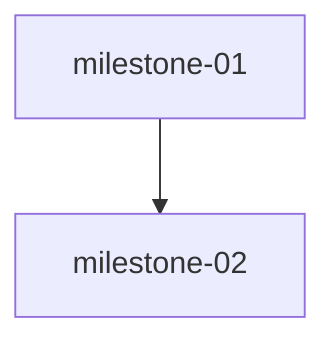

# Plan — Distributed Coding

Created: 2026-08-29T13:39:04.295Z

## Milestones
### milestone-01: Slop Removal & Direct Voice Rewrite
Remove AI slop pills (DocumentDropzone 84 Private on your device, PrivacyBadge 93 Local Vault pill + 102 aria + 114 heading + 128 paragraph 100% Client-Side, PillMap 460 Weekly pill box, LabStory 364 100% Private badge) + rewrite all we pronouns to direct functional (DocumentDropzone 79 to "Drop a PDF or photo to extract details" + 125, QuestionBank 186, FactStream 68/71/141) across 6 files. No gaps, grep slop 0, grep we word-boundary 0, screenshots 1280/375/768 clean, build 1663 intact.
- Workstreams: ws-vault-direct, ws-common-badge, ws-pillmap-labstory

### milestone-02: Polish, Responsive No-Gaps & Final Build Verification
Verify no decorative pill gaps at 320/375/768/1024/1280/1440, header/DocumentDropzone/PrivacyBadge/PillMap render clean without placeholders, adjust padding/gap if needed (no new slop), final build/lint/test/runner verification, prepare for Success Auditor gate.
- Workstreams: ws-polish-verification
- Depends on: milestone-01

## Workstreams & Ownership
- **ws-vault-direct** (milestone-01) — Vault Direct Voice & Dropzone Slop Cleanup — files: src/components/vault/DocumentDropzone.tsx, src/components/vault/FactStreamView.tsx — owner: worker_vault_direct
- **ws-common-badge** (milestone-01) — Common Badge Simplification & QuestionBank Voice — files: src/components/common/PrivacyBadge.tsx, src/components/common/QuestionBank.tsx — owner: worker_common_badge
- **ws-pillmap-labstory** (milestone-01) — PillMap & LabStory Decorative Pills Removal — files: src/components/pillmap/PillMapView.tsx, src/components/labstory/LabStoryView.tsx — owner: worker_pillmap_labstory
- **ws-polish-verification** (milestone-02) — Polish Verification & Gap Audit — files: src/App.tsx, src/components/pillmap/PillMapView.tsx, src/components/vault/DocumentDropzone.tsx — owner: worker_polish_verification — dependsOn: ws-vault-direct,ws-common-badge,ws-pillmap-labstory

## Dependency Graph

