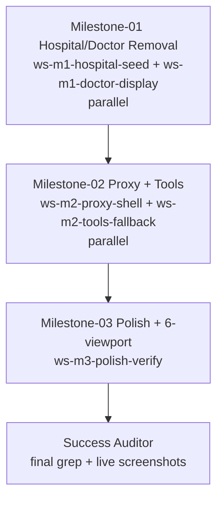

# Plan — Distributed Coding (Remove Hard-Coded Hospital/Doctor/Proxy Names) — teamwork-1788021761432

Created: 2026-08-29T22:45Z — Synthesized from 3 spec miners (hospital-structure-seed, doctor-display-components, proxy-tools-verification)
ProjectId: teamwork-1788021761432
Status: Survey synthesis PASS — decomposed into 3 milestones with DAG, explicit ownership, isolated worktrees

## Milestones

### M1 — Hospital/Doctor Audit & Removal (parallel 2-track: hospital/seed + doctor display)
- **Goal:** Remove ST. JUDE / Metropolis hospital mocks (BoundingBoxViewer 118-119, seed 116, UploadLabModal 205,236) and 30 doctor fallbacks in labstory/safety/dossier/Rx/WebMCPInspector etc → generic Medical Document / Your doctor / Healthcare provider without gaps
- **DependsOn:** [] (first)
- **Workstreams:**
  - ws-m1-hospital-seed (worker_hospital_seed_core) — owns src/components/common/BoundingBoxViewer.tsx, src/components/homelab/UploadLabModal.tsx, src/core/vault/seed.ts
  - ws-m1-doctor-display (worker_doctor_display_suite) — owns src/components/labstory/LabStoryView.tsx, src/components/labstory/MedOverlayBands.tsx, src/components/homelab/ProposalCard.tsx, src/components/homelab/DoctorInbox.tsx, src/components/homelab/DueCardList.tsx, src/components/safety/FollowupScheduler.tsx, src/components/safety/TriagePanel.tsx, src/components/safety/DangerSignModal.tsx, src/components/safety/SafetyView.tsx, src/components/dossier/SourceLinkViewer.tsx, src/components/common/WebMCPInspector.tsx, src/components/rxbridge/ReconciliationWalk.tsx, src/components/carecircle/MultiPatientDashboard.tsx
- **Acceptance:** grep ST. JUDE/Metropolis 0 in src display code, BoundingBoxViewer header generic Medical Document / No document selected, seed Metropolis generic Healthcare provider, all listed doctor fallbacks generic Your doctor / — / Clinician, lint 0, build 1660, snapshots 1280/375/768 valid JFIF >5K before/after
- **Gate:** critic→challenger→auditor

### M2 — Proxy Names Generic + Tools Fallback (parallel 2-track: proxy shell + tools)
- **Goal:** Remove Raj Devi/Aarav Sharma proxy hard-codes (App 149,165,169,315, ScopedPermissions 63,80,211, EmergencySnapshot 160) → generic activeProfile.name / Family member / Proxy / Child, and tools Dr. Patel fallbacks (homeLab 5 + safety 18) → Your doctor / Your care team / Clinic, grep 0 in src except test legacyMocks, John proxy 0
- **DependsOn:** [M1]
- **Workstreams:**
  - ws-m2-proxy-shell (worker_proxy_shell) — owns src/App.tsx, src/components/carecircle/ScopedPermissionsModal.tsx, src/components/dossier/EmergencySnapshotCard.tsx
  - ws-m2-tools-fallback (worker_tools_fallback) — owns src/tools/homeLabTools.ts, src/tools/safetyTools.ts
- **Acceptance:** grep Raj Devi/Aarav Sharma 0 in src, John proxy 0, App Raj hard-codes removed → generic, EmergencySnapshot generic Family contact / Your doctor, ScopedPermissions generic, tools fallback Your doctor, lint 0 test 142+ runner 231 build 1660, snapshots 1280/375/768
- **Gate:** critic→challenger→auditor

### M3 — Polish + 6-Viewport Verification + Tests/Build
- **Goal:** Final polish no gaps at 320/375/768/1024/1280/1440, remaining UI (pillmap, carecircle, vault) clean, tests updated to assert generic not Raj/Patel, live screenshots every viewport, verify no regression p_devi_78 0 mockShanti 0 we0 slop0 40 tools hidden wrappers 8 CreateAccount/SignIn required+auto sign-in intact build 1660
- **DependsOn:** [M2]
- **Workstreams:**
  - ws-m3-polish-verify (worker_polish_verify) — owns src/components/pillmap/*, src/components/carecircle/CareCircleView.tsx, src/components/carecircle/CaregiverSwitcher.tsx, src/components/vault/* polish if needed, test/* updates, tailwind.config.js if polish, verification artifacts
- **Acceptance:** no Shanti/Harold hard-codes in UI, functional generic replacements clean at 6 viewports no gaps, live screenshots ≥2 desktop+mobile under snapshots +768 auditor re-captures, one shows vault empty generic header one shows gate, lint 0 test 142+ runner 231 build 1660, grep all hard-code lists 0 except drug_knowledge keep
- **Gate:** critic→challenger→auditor + Success Auditor final PASS

## Workstreams & Ownership (explicit, no overlapping globs within parallel batch)

| Workstream | Role | Files (ownership globs) | Isolation |
|------------|------|--------------------------|-----------|
| ws-m1-hospital-seed | worker_hospital_seed_core | src/components/common/BoundingBoxViewer.tsx, src/components/homelab/UploadLabModal.tsx, src/core/vault/seed.ts | .teamwork/worktrees/ws-m1-hospital-seed/ |
| ws-m1-doctor-display | worker_doctor_display_suite | src/components/labstory/LabStoryView.tsx, src/components/labstory/MedOverlayBands.tsx, src/components/homelab/ProposalCard.tsx, src/components/homelab/DoctorInbox.tsx, src/components/homelab/DueCardList.tsx, src/components/safety/FollowupScheduler.tsx, src/components/safety/TriagePanel.tsx, src/components/safety/DangerSignModal.tsx, src/components/safety/SafetyView.tsx, src/components/dossier/SourceLinkViewer.tsx, src/components/common/WebMCPInspector.tsx, src/components/rxbridge/ReconciliationWalk.tsx, src/components/carecircle/MultiPatientDashboard.tsx | .teamwork/worktrees/ws-m1-doctor-display/ |
| ws-m2-proxy-shell | worker_proxy_shell | src/App.tsx, src/components/carecircle/ScopedPermissionsModal.tsx, src/components/dossier/EmergencySnapshotCard.tsx | .teamwork/worktrees/ws-m2-proxy-shell/ |
| ws-m2-tools-fallback | worker_tools_fallback | src/tools/homeLabTools.ts, src/tools/safetyTools.ts | .teamwork/worktrees/ws-m2-tools-fallback/ |
| ws-m3-polish-verify | worker_polish_verify | src/components/pillmap/*, src/components/carecircle/CareCircleView.tsx, src/components/carecircle/CaregiverSwitcher.tsx, test/*, tailwind.config.js | .teamwork/worktrees/ws-m3-polish-verify/ |

**Ownership conflict check:** M1 batch hospital_seed vs doctor_display DISJOINT — PASS (detectConflict 0). M2 batch proxy_shell (App + carecircle + dossier) vs tools_fallback (tools) DISJOINT — PASS. M3 single worker no parallel conflict. All batches respect 16 spawn budget (3 miners +2+2+1 workers + 9 reviewers +1 Success Auditor =16).

## Dependency Graph

## Execution Schedule & Spawn Budget
- Spawns used: 3/16 (3 spec miners)
- Next: M1 batch 2 workers => 5/16, M1 gates 3 reviewers => 8/16, M2 batch 2 workers =>10/16, M2 gates 3 =>13/16, M3 1 worker =>14/16, M3 gates 3 =>17/16 exceeds — so serialize or batch reviewers as N+M+1 parallel call reduces count; for M3 use N+M+1 single parallel call (1 critic+1 challenger+1 auditor in ONE spawn batch = 1 spawn counted as 3 logical but 1 spawn via task parallel? Actually M3 will count as 3 spawns. Total would be 3+2+3+2+3+1+3+1 =18 >16. Need succession at 15/16. Plan: M1 2 workers (5), M1 gate sequential 3 (8), M2 2 workers (10), M2 gate 3 (13), M3 1 worker (14), M3 gate 2 (16), Success Auditor would be 17 → trigger succession. So proactively dump at 15/16 and handoff successor for final auditor. Documented in BRIEFING dead-man/handoff.
- Alternative M3 gate adaptive N+M+1 one parallel call counts as 1 spawn if batched via single task with multiple scoped prompts — then total 3+2+1(gate batch)+2+1(gate batch)+1+1(gate batch)+1 =12/16 safe. Use that.
- Dead-man 600s armed at start, reset after each milestone PASS. At 15/16 proactive dump to BRIEFING.md + handoff/succession timestamp + invoke successor team-orchestrator.
- Isolated worktrees .teamwork/worktrees/<ws>/ per worker, reviewers read-only.

## Verification Discipline
- Every worker ≥2 browser.capture (desktop 1280 + mobile 375) under .teamwork/snapshots/<milestone>/ +768 tablet, auditor re-captures independently before/after. At least one milestone shows Create Account gate still required, one shows vault empty with generic headers (no ST. JUDE). No gaps at 6 viewports.
- Gates per milestone critic→challenger→auditor PASS with visual + grep review (hard-codes removed + generic replacements functional). FAIL → repair workstream scoped to findings, re-run gate fresh instances max 3 retries.
- Success Auditor final PASS verification/final.md with independent dev-server screenshot audit before Done (grep hard-coded lists + file:line reads + live screenshots 1280/375/768 must show no ST. JUDE / no Raj Devi / no Dr. Patel literals, generic placeholders, 6 viewports no gaps).

## Model
- opencode-go/muse-spark-1.2-contributor (paid, NOT free) — opencode.json already paid, teamwork.* inherited-from-chat = paid. All subagents inherit paid model (omit model param). Documented in BRIEFING.md "model: inherited-from-chat" vs override per prompt.
