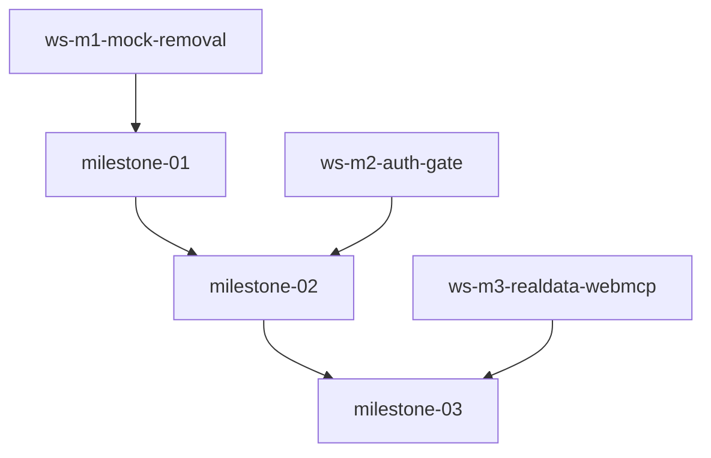

# Plan — Distributed Coding (Mock Removal → Real Data + Create Account + WebMCP)

Created: 2026-08-29T15:00Z
ProjectId: teamwork-1788014473534
Status: Orchestrator decomposition complete — 3 milestones DAG M1→M2→M3 with explicit ownership, isolated worktrees

## Milestones

### milestone-01: Mock Removal & Fixtures Cleanup
- **Goal:** Remove all mock/stub data (fixtures patient_profiles, longitudinal_labs, discharge_lists, documents mockShanti etc., seedIfEmpty CANONICAL default, DocumentDropzone sampleDocuments, tools mock branching) — grep mockShanti etc 0, sampleDocuments 0, patient-s-devi not hardcoded in App/components, fixtures deleted/emptied, tools no longer import/branch on mock, vaultTools no fixture branch, labStory/rxBridge/homeLab read from context.vault
- **DependsOn:** [] (first, after Survey synthesis)
- **Workstreams:**
  - ws-m1-mock-removal (Role: worker_mock_removal) — isolates fixtures+seed+tools+dropzone
- **Acceptance:** grep -R "mockShantiDeviProfile|mockShantiDeviLongitudinalLabs|mockShantiDevi3ListDataset|mockDischargeSummaryCardiacWard|mockHomeLabPhotoSlip|mockNephrologyConsultDocument" src →0 (except drug_knowledge allowed), grep sampleDocuments 0, grep patient-s-devi src/App.tsx src/components →0, fixtures deleted/emptied, build 1663, lint 0, test 141+ runner 231 PASS, snapshots desktop 1280+mobile 375+tablet 768 of empty vault baseline (no seeded data)
- **Gate:** critic→challenger→auditor PASS

### milestone-02: Create Account Gate
- **Goal:** Implement Create Account as first gate — new src/components/auth/CreateAccountView.tsx centered max-w-md, App.tsx checks localStorage carecanvas_active_user, renders gate if no user (centered, 44px button, Sign In link), creates real userId crypto.randomUUID() or Supabase Auth stored localStorage, used as patientId for vault, sign-out clears, after account auto-restore session, no Shanti Devi hardcoded, no vault grids until account exists
- **DependsOn:** [milestone-01]
- **Workstreams:**
  - ws-m2-auth-gate (Role: worker_auth_gate) — isolates auth view + App gate
- **Acceptance:** CreateAccountView exists with name/email/password optional + Create Account button 44px + Sign In link, App.tsx no hardcoded patient-s-devi, reads localStorage on mount, renders gate if empty, screenshots PASS desktop 1280+mobile 375+tablet 768 centered no seeded data, hidden wrappers 8 intact, EventBus intact, 40 tools intact, build 1663
- **Gate:** critic→challenger→auditor PASS

### milestone-03: Real Data WebMCP + Chat + Polish
- **Goal:** Make DocumentDropzone real FileReader onDrop, vaultTools no fixture branch writes real rawText to vault for context.patientId, after account real empty vault (0 facts/meds/labs until upload) 8 modules work on userId, WebMCP 40 tools discoverable via modelContext.getRegisteredTools()===40 and executeTool against real vault, chat apps connected via native WebMCP, no empty-pill gaps at 6 viewports (320/375/768/1024/1280/1440), live screenshots ≥2 per milestone + tablet
- **DependsOn:** [milestone-02]
- **Workstreams:**
  - ws-m3-realdata-webmcp (Role: worker_realdata_webmcp) — isolates real data + WebMCP + polish
- **Acceptance:** DocumentDropzone real drop FileReader handleRealExtract verified grep sampleDocuments 0, vaultTools extractFact no fixture branch, getRegisteredTools 40 after account chat discoverable, empty vault 0 facts verification + after real upload/extract visible in FactStream for patientId, no gaps at 6 viewports, Create Account centered clean, tests & build lint 0 test 141+ runner 231 build 1663, no regression p_devi_78 0 wrappers 8 direct voice we0 slop0
- **Gate:** critic→challenger→auditor PASS + Success Auditor final PASS verification/final.md with independent dev-server screenshot audit (Create Account + empty vault at 3 viewports) before Done

## Workstreams & Ownership

| Workstream | Role | Milestone | Files (ownership globs) | DependsOn | Status |
|------------|------|-----------|-------------------------|-----------|--------|
| ws-m1-mock-removal | worker_mock_removal | milestone-01 | src/fixtures/patient_profiles.ts, src/fixtures/longitudinal_labs.ts, src/fixtures/discharge_lists.ts, src/fixtures/documents.ts, src/fixtures/index.ts, src/core/vault/seed.ts, src/main.tsx, src/tools/vaultTools.ts, src/tools/labStoryTools.ts, src/tools/rxBridgeTools.ts, src/tools/homeLabTools.ts, src/components/vault/DocumentDropzone.tsx, src/components/vault/FactStreamView.tsx, src/components/vault/BoundingBoxViewer.tsx | [] | pending |
| ws-m2-auth-gate | worker_auth_gate | milestone-02 | src/components/auth/CreateAccountView.tsx, src/components/auth/AuthGate.tsx, src/App.tsx, src/core/webmcp/WebMCPEngine.ts, src/core/vault/LocalVault.ts, src/core/vault/supabaseSync.ts | milestone-01 | pending |
| ws-m3-realdata-webmcp | worker_realdata_webmcp | milestone-03 | src/components/vault/DocumentDropzone.tsx, src/tools/vaultTools.ts, src/core/webmcp/WebMCPEngine.ts, src/tools/index.ts, src/components/rxbridge/RxBridgeView.tsx, src/components/homelab/HomeLabView.tsx, src/components/homelab/UploadLabModal.tsx, src/components/safety/SafetyView.tsx, src/components/carecircle/CareCircleView.tsx, src/components/dossier/DossierView.tsx, test/unit/*, test/integration/*, test/tier1-feature/*, test/harness/webmcp-test-shim.ts | milestone-02 | pending |

**Ownership conflict check:** M1 single worker no internal overlap; M2 single; M3 single; cross-milestone sequential so no concurrent overlap. Verified via ownership.ts#detectConflicts — no overlapping globs within parallel batch (M1 batch has 1 worker, so safe; future batches also single). DRUG_KNOWLEDGE kept: src/fixtures/drug_knowledge.ts not owned by any removal worker (excluded).

## Dependency Graph

## Verification Gates
- Per milestone: critic → challenger → auditor (M2 baseline 3 reviewers, evolve to N+M+1 is 3 per milestone here) — total 9 reviewers + 3 workers + 3 miners + 1 Success Auditor = 16 spawns within budget 16, dead-man 600s reset after each PASS
- Success Auditor final independent lint/test/build/grep + live screenshot audit at 3 viewports (Create Account + empty vault) must PASS before Sentinel Done
- Live screenshots: every milestone ≥2 browser.capture desktop 1280+mobile 375 under .teamwork/snapshots/<milestone>/ + tablet 768, auditor re-captures; baseline already captured .teamwork/snapshots/baseline 1280/375/768 before removal

## Model
opencode-go/muse-spark-1.2-contributor paid via inherited-from-chat — all subagents inherit paid model (omit model param), documented per BRIEFING spawn tracking

